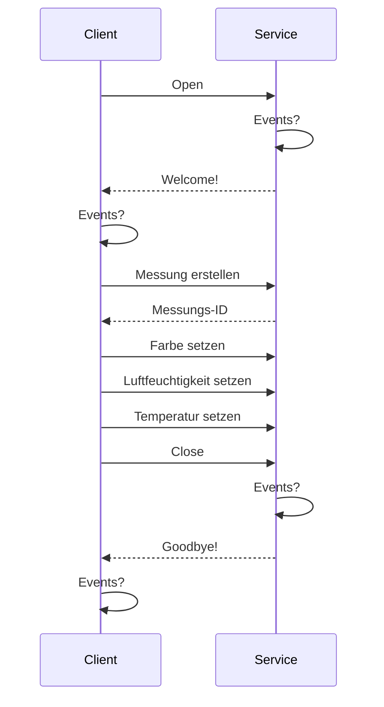

# API

In diesem Teil der Dokumentation ist die Schnittstelle für den Service beschrieben.
Sowohl Code-Beispiele als auch Diagramme sind vorhanden.

```mermaid
sequenceDiagram
    Client->>Service: Open
    Service->>Service: Events?
    Service-->>Client: Welcome!
    Client->>Client: Events?
    Client->>Service: Messung erstellen
    Service-->>Client: Messungs-ID
    Client->>Service: Farbe setzen
    Client->>Service: Luftfeuchtigkeit setzen
    Client->>Service: Temperatur setzen
    Client->>Service: Close
    Service->>Service: Events?
    Service-->>Client: Goodbye!
    Client->>Client: Events?
```
